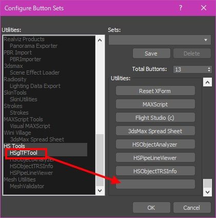

# glTF 2.0 Editing in Autodesk 3ds Max

Assets can be created and adjusted in 3ds Max for export to glTF format. Several tools are available for editing glTF-compliant content.

## KHR_animation_pointer

The KHR_animation_pointer extension, which performs parameter animations
(material, light, camera) other than object motion and morph weight, is
supported for both import and export.

## KHR_physics_rigid_bodies/KHR_collision_shapes

These extensions have not yet been ratified.

* Partial support for `KHR_physics_rigid_bodies` and `KHR_collision_shapes`.

These extensions perform physics simulations such as collision
detection, etc. 

The importer passes the information defined by the
extension to MassFX. Therefore, simulation results on other platforms
(e.g. Blender) may differ.

## Webp/KTX2 Encode Attribute

WebP and KTX2 image format converted to PNG format during import. At this
time, the original file path is added to the Texmap object as a Custom Attribute.

Note: The compression parameters displayed in the Custom Attributes
are for encoding during export and do not represent the attributes of
the currently loaded map.

If the "Enable" checkbox in the attributes is checked, the map will be
converted to the corresponding format and output during export.

If a valid file path is specified, that file will be output directly.
This is to prevent image degradation from re-encoding and to avoid
encoding lag.

To output the map using new compression parameters, please delete the
file path.

To encode a newly created map:

Select the object assigned with the map, and launch HSglTFTool from the
Utilities tab.

Click the "AddMtlAttr" button to add the attributes.

Check "Enabled" for the attributes you wish to encode and set the
parameters.

Note: Setting KTX2 encoding parameters to high quality/high compression will
increase encoding time. Please verify your settings in advance.

When Mipmap is turned on, the map dimensions must be a Power of Two
(e.g., 256, 512, 1024) for both width and height.

A custom attribute that is added to the bitmap texture to support the
webp image format. Since 3ds Max does not support the Webp format, the
importer will convert the Webp image file to PNG format for loading. The
original Webp file name is listed in OriginalPath. The original Webp
file name is listed in the OriginalPath and is used during export.

If you want to output non-Webp image files in Webp format, check
Enabled.

If OriginalPath is empty, the currently used bitmap is converted to Webp
and output. In this case, the QualityFactor and Lossless settings are
used.

## Copyright Notation

The description of the company in the "File Properties" dialog is copied
to the "Copyright" section of the gltf file.

## Execute from Script

Calling importer method: `importFile FileName`

If you are using multiple gltf import plugins: `importFile FileName using:#(2276006501L, 2723547238L)`

Calling exporter method: `exportFile FileName`

If you are using multiple gltf export plugins: `exportFile FileName using:#(945315888L, 456219454L)`

The parameters set in the plugin are written in the following INI file,
which can be modified to set the parameters before executing command. `(getDir \#plugcfg)+"\\HSglTFImporter.ini"`

## MtlSwitcher

MtlSwitcher is a switch material with the ability to switch between
multiple materials to import and export material variants with 3ds Max. 

For more information on material variants in glTF see the extension [KHR_materials_variants](https://github.com/KhronosGroup/glTF/blob/main/extensions/2.0/Khronos/KHR_materials_variants/README.md).

This material is a custom material added to 3ds Max 2023 and earlier
versions. 3ds Max 2024 has this functionality implemented as standard,
so this material has been removed. Importer and exporter use the
standard implemented switch material to realize Material Variant.

### Installation

MtlSwitcher is provided as a script file (MtlSwitcher.ms). By copying
the script file to the "Scripts\startup" folder, it is not necessary to
execute the script each time when restarting the program.

The switch material is implemented as a plug-in material. Scene files
using this material will not open properly in other 3ds Max
environments. Execute the MtlSwitcher script in the target 3ds Max
environment beforehand.

### Functionality

Up to 8 materials can be assigned to a single object and one of those
materials can be enabled. Each material type has its own switch
material, and different materials cannot be mixed. Currently five switch
materials are provided, each corresponding to the following materials:
- Scanline Material
- Physical Material 
- PBR Material 
- glTF Material 
- USD Material

### Import Material Variant

Loading glTF with "Use SwitchMtl for Variant" is turned on, the
MtlSwitcher will be created for the material variant. Composite Material
will be used for unsupported materials.

### Export Material Variant

Node materials to which MtlSwitcher is assigned are output as Material
Variant.

## Extended Parameter Addition Tool

Custom attributes that are automatically added by the importer when
reading glTF files can be added with the utility tool.

- Attributes are added to materials assigned to objects in the scene.

- Attributes are not added to materials that are not assigned to objects.

- Run the tool each time you create a new material.

- Even if you run the tool multiple times, the attribute will not be added twice.

## glTF Interactivity Extension 

Support for khr_interactivity is partially implemented.