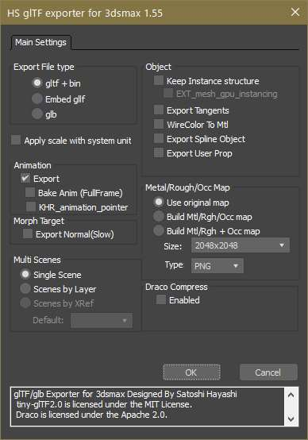

# glTF 2.0 Exporter for Autodesk 3ds Max

When glTF files are exported, the contents must be packed and formatted properly. The exporter offers several options for what glTF format to create, what features to include or ignore, how to pack textures, and whether to use geometry compression.

### Supported Export Formats

The glTF 2.0 format is supported, in the following types:
- .gltf + .bin 
- .gltf embedded
- .glb

glTF 1.0 is not supported.

### Exporter Features
* **Format Types**: `*.gltf` + `*.bin` + textures, `*.gltf` (embedded), `*.glb` (binary)
* **Object Types**: Geometry (Mesh), Spline, Shape, Camera, Lights
* **Compression**: Draco compression supported
* **Materials**: Scanline, PBR, Physical, glTF, Arnold, V-Ray, Corona, Pencil+4, USD
    * glTF Material is not supported in 3ds Max 2021/2022
    * Material variants (only for materials supported by MtlSwitcher)
* **Animation**: Object TRS, LINEAR/STEP interpolation, Morph weight, `KHR_animation_pointer`
* **Vertex Deformation**: Skin, Morph
* **Custom Attributes**: Scene, Node, and Material data (stored in `extras`)

### Exporter Limitations

The following functions are not implemented in the current version

- Output of KTX2 compressed image files

- BezierSpline, Step animation interpolation 

- Multi channel animation

- Mirror-transformed objects may not be output correctly. It is recommended to apply "Reset XForm" to the object before exporting.

- There is a limit to the number of primitive attributes that can be
supported 

  - UV coordinate channel: 2 channel (TEXCOORD_0, TEXCOORD_1)

  - Vertex color channel: 1 channel (COLOR_0)

  - Skin weight channel: 4 weights per vertex (WEIGHTS_0)

### Exporter Settings Dialog

#### Export File type

 `glTF + bin` = The glTF scene is output as multiple files, and the .BIN file and image files are copied to the output folder.

 `Embed glTF` = A single .glTF file is output, with resources embedded as ASCII data.

 `glb` = A single .GLB file is output, with resources embedded as binary data.

#### Scale

 `Apply scale with system unit` = Applies scaling based on the system unit settings to match the glTF unit system (meters).

#### Object

 `Keep Instance structure` = Export instance object as mesh shared node.

- In glTF, mesh shared node do not have different materials.

- In the exporter, object offset values are assigned to object mesh coordinates. Therefore, if objects in an instance have different offset values, the result will not be as expected when the Instance is on.

 `EXT_mesh_gpu_instancing` = Export instance objects in EXT_mesh_gpu_instancing mode. Objects output in this mode do not have a hierarchical structure. Be sure to place them on the top node. Also, since much of the node information, such as animation, may be lost, this option should be turned off depending on the purpose of the export data.

 `Export Tangents` = Adds tangent space information. 

 `WireColor To Mtl` = When outputting an object that does not have a material, the object's wire color is output as the material.

 `Export Spline Object` = Spline objects are exported. Note: NURBS Object is not exported. (Exported as dummy object) 

 `Export User Prop` = Outputs user-defined properties of objects. 

#### Metal/Rough/Occ map

Specifies how the Metalness/Roughness/AmbientOcclusion composite map is
created. 

 `Use original map` = The Metalness/Roughness/AmbientOcclusion map read on import will be used on export as is. If the map structure is other than the original map, the map cannot be obtained.

 `Build Mtl/Rgh/Occ map` = For map structures other than the above, the exporter will create a map, outputting Metalness/Roughness/AmbientOcclusion in one map.

 `Build Mtl/Rgh + Occ map` = Output separate maps for Metalness/Roughness and AmbientOcclusion.

 `Size` = Set the resolution of the built maps. 

 `Type` = Set the file type of the built maps.

#### Draco Compress

 `Enabled` = Draco mesh compression is applied, and the extension [KHR_draco_mesh_compression](https://github.com/KhronosGroup/glTF/blob/main/extensions/2.0/Khronos/KHR_draco_mesh_compression/README.md) is added.

#### Animation

 `Export` = Animation is exported.

 `Bake Anim（FullFrame)` = Since animations are output based on controller keys, turn this switch ON when exporting procedural controllers (constraint, expression controllers, etc.) that do not have keys. When this switch is turned on, all animations in the scene are exported as BakeAnim, which increases
the data size.

 `KHR_animation_pointer` = Turn this switch ON if you want to output animations other than object motion and morph weighting. See [KHR_animation_pointer](https://github.com/KhronosGroup/glTF/blob/main/extensions/2.0/Khronos/KHR_animation_pointer/README.md) for details.

#### Morph Target

 `Export Normal(Slow)` = Outputs the normal of the target object when morphing. 

#### Multi Scenes

Export the current scene as a glTF multi-scene. See [Exporting Multiple
Scenes]() for details.

## glTF Export Processing 

### Vertex Color

Vertex color information is output only for objects for which the
display of vertex color is turned on in the object properties.

### Animation Interpolation

Only linear interpolation is supported for animation output. Other
interpolation types will be converted to linear.

To output animations without keys (such as expression controllers), turn
on Bake Animation. 

### Skin deformation

Due to limitations of glTF, skin deformations output by this plug-in may
not be displayed correctly in some viewers. If the skin is not displayed
correctly in your environment, please check the following points.

The Skin modifier in 3ds Max allows vertices that are not affected by
any bones. In glTF, the total weight value of any vertex must be 1.0.
This means that every vertex must be affected by one or more bones in
the glTF.

The bone structure of the 3ds Max Skin modifier does not have to be
hierarchical. In glTF, the bone nodes that make up one skin deformation
must be hierarchical with a common parent node.

The maximum number of bones per vertex that can be output with the
exporter is 4. Weights exceeding that number will not be output.

## Exporting Multiple Scenes
This exporter is capable of multi-scene
output. 

### Multi-scene with layers

The exported scenes are separated by layer. The current layer becomes
the default scene. Objects in the parent-child hierarchy must exist in
the same layer.

### Multi-scene with XRef

Outputs separate scenes for each XRef scene. （Objects placed in the
original scene (not belonging to an XRef scene) are output in common to
each XRef scene.

## Exporting User-Defined Parameters

The plug-in exports the following user-defined parameters to object
extras. 

### Scene

File Properties/Custom Properties(Number,String)

### Nodes

Custom attributes 

Object properties 

### Materials

Custom Attributes

Outputs the following parameter types of custom attributes to be
assigned by the parameter edit command.

- Numeric (integer, float) 

- String

- Color value (Animation is not supported)

The object property of a node outputs parameters described in the
following user-defined format. 

- Name = Value

- Values are treated as strings, except for numeric values.

When reading a glTF file, extended data registered as unsupported
parameters are output as glTF parameters. See [glTF Extension Parameters]()
