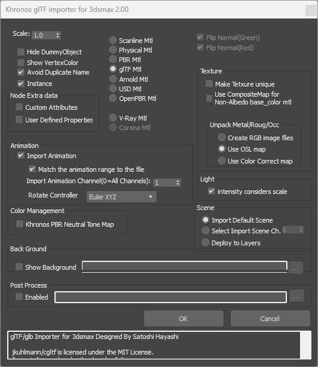
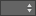
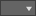

# glTF 2.0 Importer for Autodesk 3ds Max

When glTF files are imported, the contents must be unpacked and formatted for editing within 3ds Max. The importer offers several options for how to set up the file contents, what to keep or discard, and which material formats to use.

### Supported Import Formats

The glTF 2.0 format is supported, in the following types:
- .gltf + .bin 
- .gltf embedded
- .glb

glTF 1.0 is not supported.

### Importer Features
* **Format Types**: `*.gltf` + `*.bin` + textures, `*.gltf` (embedded), `*.glb` (binary)
* **Object Types**: Geometry (Mesh), Spline, Shape, Camera, Lights
* **Compression**: Draco compression supported
* **Materials**: Scanline, PBR, Physical, glTF, Arnold, V-Ray, Corona, USD
    * glTF Material is not supported in 3ds Max 2021/2022
* **Animation**: Object TRS, LINEAR/STEP interpolation, Morph weight, `KHR_animation_pointer`
* **Vertex Deformation**: Skin, Morph
* **Custom Attributes**: Scene, Node, and Material data (stored in `extras`)

### Importer Limitations

- Only mesh vertex/normal can be morphed. 

- 3ds Max 2020/2021/2022 do not support glTF Material. 

- 3ds Max 2020/2021/2022 do not support PBR Material.

- 3ds Max 2020/2021 do not support V-Ray/Corona Materials.

- There is a limit to the number of primitive attributes that can be
supported:
  - UV coordinate channels:2channels（TEXCOORD_0 , TEXCOORD_1）
  - Vertex color channel:1channnel（COLOR_0）
  - Skin weight channel:4 weights per vertex（WEIGHTS_0）

- Mapping of mesh objects that have primitives with and without texture
coordinates will not be displayed correctly.

- Some combinations of texture clips and UV offsets will not render
textures correctly.

### Importer Settings Dialog

 `Scale` = Set the scale to be applied to imported nodes; 1.0 equals 100% scale.

 `Hide Dummy Object` = Hide any nodes without mesh data（Dummy objects).

 `Show Vertex Color` = For objects with vertex color, the vertex channel display of the
target object property is set to display vertex color. Note: Hardware shaders do not work in vertex color display mode. 

 `Avoid Duplicate Name` = Renames duplicate objects so that there are no objects with the same name in the scene. It also performs automatic naming for objects that do not have a
name.

 `Instance` = The node with which the mesh is shared is created in the scene as instance object. Note: Objects generated by [EXT_mesh_gpu_instancing](https://github.com/KhronosGroup/glTF/blob/main/extensions/2.0/Vendor/EXT_mesh_gpu_instancing/README.md) are always imported as instances regardless of this switch.

#### Node Extra Data
Specify where to extract extra data for the node.

 `Custom Attributes` = Extra data is stored using Custom Attributes.

 `User Defined Properties` = Extra data is stored using User Defined Properties.

#### Material Type
Converts the glTF material information into a material type supported by 3ds Max. 

 `Scanline Mtl`

 `Physical Mtl`

 `PBR Mtl` = This is converted to either “metal/roughness” or “specular/glossiness” depending on the material defined in the glTF file to be read. See [KHR_materials_pbrSpecularGlossiness](https://github.com/KhronosGroup/glTF/blob/main/extensions/2.0/Archived/KHR_materials_pbrSpecularGlossiness/README.md) for more information.

 `glTF Mtl`

 `Arnold Mtl`

 `USD Mtl`

 `OpenPBR Mtl`

 `V-Ray Mtl`

 `Corona Mtl`

Note: V-Ray/Corona/Arnold/USD need to be installed if you want to choose any of these conversions.

#### Flip Normal
 `Flip Normal(Green)` = Flips the green channel of the normal map via a material setting.

 `Flip Normal(Red)` = Flips the red channel of the normal map via a material setting.

The flip process is different for each material to be converted, but the
original normal map is not changed.

When `glTF Material` is chosen, these options are ignored. 

#### Texture

 `Make Texture Unique` = When multiple materials reference the same texture, unique texture will
be generated and assigned to each material. Activate this switch if the same texture is
used by two or more materials with different UV coordinates.

 `Use CompositeMap for Non-Albedo base-color Mtl` = If the material to be converted does not support Albedo, the base color will be overwritten by the texture. Activate this switch if you want the texture and base color to be displayed using a CompositeMap node.

#### Unpack Metal/Roug/Occ
Specifies how to extract the metalness, roughness, and occlusion maps from the original map file.

 `Create RGB image files` = New map files are created by decomposing each RGB channel from the input texture. 

 `Use OSL map` = The input texture is loaded and outputs are split via an OSL Map node.

 `Use ColorCorrect map` = The input texture is loaded via Bitmap Map and outputs are split via Color Correct nodes. 

#### Light

 `Intensity considers scale` = Corrects the intensity of the light, taking into account the scale at importing. Affects point lights and spot lights only.

#### Scene 

 `Import Default Scene` = When loading a file with multiple scenes, the default scene is loaded.

  `Select import Scene Channel` = Specifies the scene channel to load. 

 `Deploy to Layers` = Load each scene layer by layer.

#### Animation

 `Import Animation` = Animations will be imported. Note: CUBICSPLINE animation interpolation is supported for Translation only, not for Rotation nor for Scale.

 `Match the Animation range to the file` =  Matches the animation range of the scene to the animation range of the imported file.

 `Import Animation Channel` When importing a glTF file with multiple animation channels, specify which channel to load. When the channel is set to 0, all animation channels will be loaded at once, but if multiple animations are assigned to the same object, the last animation channel will be activated.

 `Rotate Controller` = Select a rotational animation controller type for import conversion.

  - Euler XYZ

  - Linear Rotation

#### Color Management

 `Khronos PBR Neutral Tone Map` = Switches to a color space that approximates the PBR-neutral tone map proposed by Khronos. This feature is available in 3ds Max 2024 and later. For more information about the PBR-neutral tone map, please see the press release [Khronos PBR Neutral Tone Mapper Released for True-to-Life Color Rendering of 3D Products](https://www.khronos.org/news/press/khronos-pbr-neutral-tone-mapper-released-for-true-to-life-color-rendering-of-3d-products).

#### Back Ground
 `Show Back Ground` = Displays the specified image file as an environment map in the viewport. 

#### Post Process
 `Enabled` = You can specify a process you want to execute automatically after importing a file in a script file.

## glTF Import Processing

The importer generates and modifies image data and map objects as necessary when converting data to materials that are incompatible with glTF.

### Auto-Generated Image Files

The importer automatically generates image files that are required when loading files. The generated image files will be placed in “Images” folder in the folder where the original files are placed.

Embedded glTF or glb file contains the image data in it. So the importer will extract the embedded image data and generate the image file(s).

In glTF, Metalness/Roughness/Occlusion map files are stored in a single image file, separated by RGB channels. The plugin decomposes each channel and creates separate image files for each (when “Use OSL map for Mtl/Rgh/Occ” switch is OFF).

### Auto-Generated Map Nodes

Since non-glTF materials do not support all the features of glTF, the importer will create map nodes as needed to build a representation as close as possible to the original data.

| Converted To | Base color | Normal map | Opacity map | Metal/Rough/Occlusion |
| --- | --- | --- | --- | --- | 
| Scanline | CompositeTex | NormalMap | *CutOff* | BitmapLookup/UberBitmap |
| Physical | CompositeTex | NormalMap | Subtract/*CutOff* | BitmapLookup/UberBitmap |
| PBR | | | *CutOff* | BitmapLookup/UberBitmap |
| Arnold | CompositeTex | NormalMap | *CutOff* | BitmapLookup/UberBitmap |
| USD | CompositeTex | | | BitmapLookup/UberBitmap |
| glTF | | | | BitmapLookup/UberBitmap |
| V-Ray | VRayCompTex | VRayNormalMap | | BitmapLookup/UberBitmap |
| Corona | CoronaMix | CoronaNormal | *CutOff* | BitmapLookup/UberBitmap |

- Composite map will be generated only when both base color and base
color texture are set and "Use CompositeMap" is turned on.

- *CutOff* is generated when the alpha mode is MASK. These are OSL maps automatically created by the importer and are not from the 3ds Max material library.

- BitmapLookup/UberBitmap is generated when the "Use OSL map for Mtl/Rgh/Occ" switch is on.

### KHR_materials_pbrSpecularGlossiness Defined Materials

When `PBR Material` is selected, if an input material using  [KHR_materials_pbrSpecularGlossiness](https://github.com/KhronosGroup/glTF/blob/main/extensions/2.0/Archived/KHR_materials_pbrSpecularGlossiness/README.md) is loaded, it will be converted to PBR (specular/glossiness). Materials not using this extension will be converted to PBR (metallic/roughness). Any other materials will not be converted correctly.

### SwitchMtl for Variants

Material variants using [KHR_materials_variants](https://github.com/KhronosGroup/glTF/blob/main/extensions/2.0/Khronos/KHR_materials_variants/README.md) are implemented in 3ds Max using a Material Switch material, which depends on the chosen type of material conversion.

| Material Type | Switch Material |
| --- | --- |
| Scanline | Mtlswitcher |
| Physical | Mtlswitcher |
| PBR Metal/Rough | Mtlswitcher |
| glTF | Mtlswitcher |
| USD | Mtlswitcher |
| Arnold | SwitchShader |
| V-Ray | CompositeMtl |
| Corona | CoronaSelectMtl |

To use the Mtlswitcher in 3dsMax2023 or earlier, the script file `Mtlswitcher.ms` must be run beforehand. See MtlSwitcher for details. 

3dsMax2024 or later uses the MaterialSwitcher material. 

This switch was removed in 3dsMax2025.

### Loading Extra Parameters 

User defined parameters described in the extras of Nodes and Materials are imported as Custom Attributes. In the case of a Node, they can also be loaded as User Properties.

The extras of Scenes are imported as file properties/custom parameters. 

glTF material parameters that cannot be represented in the chosen material type are loaded as Custom Attributes.

| | Scanline | Physical | PBR | glTF | Arnold |
| - | - | - | - | - | - | 
| AlphaMode | ✓ | ✓ | ✓ | | ✓ | 
| Unlit | | ✓ | ✓ | | 
| Iridescence | | *1 | ✓ | ✓ | *1 | 
| IOR | | | ✓ | | 
| EmissiveStrength | | | ✓ | ✓ | | 
| Volume | | ✓ | ✓ | | | 
| Sheen | | | ✓ | | | 
| Clearcoat | | | ✓ | | | 
| Transmission | | | ✓ | | | 
| Anisotropy | | | ✓ | ✓ | |  
| Dispersion | | | ✓ | ✓ | | 
| DiffuseTransmission | | ✓ | ✓ | ✓ | ✓ | 

\*1: Iridescence is set to thin-film parameters in the Physical and Arnold materials.

