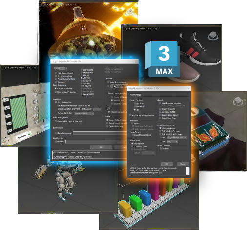

# glTF 2.0 Importer/Exporter for Autodesk 3ds Max

This documentation for end users describes the glTF importer and exporter plug-ins for Autodesk 3ds Max, and is divided into three sections:

1. **[glTF Importer](ImporterDocumentation.md)** explains the options for importing and formatting the scene for use in 3ds Max.
1. **[glTF Editing](EditingDocumentation.md)** explains the tools within 3ds Max for editing and preparing glTF content.
1. **[glTF Exporter](ExporterDocumentation.md)** explains the options for exporting the scene out from 3ds Max into glTF format. 

## glTF Extensions Supported
| glTF Extension | Import | Export |
| --- | --- | --- |
| [KHR_animation_pointer](https://github.com/KhronosGroup/glTF/blob/main/extensions/2.0/Khronos/KHR_animation_pointer/README.md) | yes | yes |
| [KHR_draco_mesh_compression](https://github.com/KhronosGroup/glTF/blob/main/extensions/2.0/Khronos/KHR_draco_mesh_compression/README.md) | yes | yes |
| [KHR_lights_punctual](https://github.com/KhronosGroup/glTF/blob/main/extensions/2.0/Khronos/KHR_lights_punctual/README.md) | yes | yes |
| [KHR_materials_anisotropy](https://github.com/KhronosGroup/glTF/blob/main/extensions/2.0/Khronos/KHR_materials_anisotropy/README.md) | yes | yes |
| [KHR_materials_clearcoat](https://github.com/KhronosGroup/glTF/blob/main/extensions/2.0/Khronos/KHR_materials_clearcoat/README.md) | yes | yes |
| [KHR_materials_dispersion](https://github.com/KhronosGroup/glTF/blob/main/extensions/2.0/Khronos/KHR_materials_dispersion/README.md) | yes | yes |
| [KHR_materials_emissive_strength](https://github.com/KhronosGroup/glTF/blob/main/extensions/2.0/Khronos/KHR_materials_emissive_strength/README.md) | yes | yes |
| [KHR_materials_ior](https://github.com/KhronosGroup/glTF/blob/main/extensions/2.0/Khronos/KHR_materials_ior/README.md) | yes | yes |
| [KHR_materials_iridescence](https://github.com/KhronosGroup/glTF/blob/main/extensions/2.0/Khronos/KHR_materials_iridescence/README.md) | yes | yes |
| [KHR_materials_sheen](https://github.com/KhronosGroup/glTF/blob/main/extensions/2.0/Khronos/KHR_materials_sheen/README.md) | yes | yes |
| [KHR_materials_specular](https://github.com/KhronosGroup/glTF/blob/main/extensions/2.0/Khronos/KHR_materials_specular/README.md) | yes | yes |
| [KHR_materials_transmission](https://github.com/KhronosGroup/glTF/blob/main/extensions/2.0/Khronos/KHR_materials_transmission/README.md) | yes | yes |
| [KHR_materials_unlit](https://github.com/KhronosGroup/glTF/blob/main/extensions/2.0/Khronos/KHR_materials_unlit/README.md) | yes | yes |
| [KHR_materials_variants](https://github.com/KhronosGroup/glTF/blob/main/extensions/2.0/Khronos/KHR_materials_variants/README.md) | yes | yes |
| [KHR_materials_volume](https://github.com/KhronosGroup/glTF/blob/main/extensions/2.0/Khronos/KHR_materials_volume/README.md) | yes | yes |
| [KHR_mesh_quantization](https://github.com/KhronosGroup/glTF/blob/main/extensions/2.0/Khronos/KHR_mesh_quantization/README.md) | yes | yes |
| [KHR_texture_basisu](https://github.com/KhronosGroup/glTF/blob/main/extensions/2.0/Khronos/KHR_texture_basisu/README.md) | yes | yes |
| [KHR_texture_transform](https://github.com/KhronosGroup/glTF/blob/main/extensions/2.0/Khronos/KHR_texture_transform/README.md) | yes | yes |
| [EXT_mesh_gpu_instancing](https://github.com/KhronosGroup/glTF/blob/main/extensions/2.0/Vendor/EXT_mesh_gpu_instancing/README.md) | yes | yes |
| [EXT_meshopt_compression](https://github.com/KhronosGroup/glTF/blob/main/extensions/2.0/Vendor/EXT_meshopt_compression/README.md) | yes | |
| [EXT_texture_webp](https://github.com/KhronosGroup/glTF/blob/main/extensions/2.0/Vendor/EXT_texture_webp/README.md) | yes | yes |
| [KHR_materials_pbrSpecularGlossiness](https://github.com/KhronosGroup/glTF/blob/main/extensions/2.0/Archived/KHR_materials_pbrSpecularGlossiness/README.md) | yes | |

## glTF Extensions Partially Supported
Initial steps have been taken to support the export of content using these extensions. However these extensions have not been ratified yet, and may undergo significant change. 
| glTF Extension | Import | Export |
| --- | --- | --- |
| [KHR_collision_shapes](https://github.com/KhronosGroup/glTF/pull/2370) | | yes |
| [KHR_interactivity](https://github.com/KhronosGroup/glTF/pull/2293) | | partial support |
| [KHR_materials_diffuse_transmission](https://github.com/KhronosGroup/glTF/blob/main/extensions/2.0/Khronos/KHR_materials_diffuse_transmission/README.md) | yes | yes |
| [KHR_physics_rigid_bodies](https://github.com/KhronosGroup/glTF/pull/2424) | | partial support |
